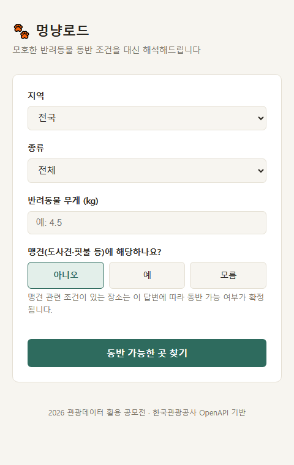
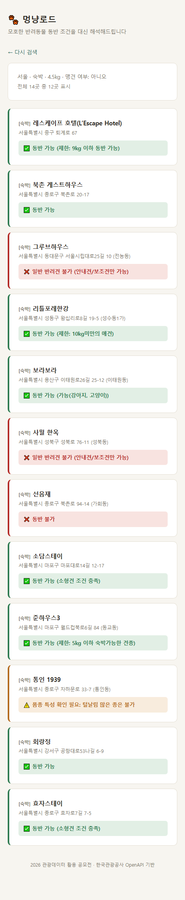

# 멍냥로드 (pet-travel-guide)

반려동물 동반 조건이 자유 텍스트로 되어 있고 결측이 많은 문제를, 반려동물의 크기·무게·맹견 여부를
기준으로 자동 해석해 보완해주는 서비스. 한국관광공사 OpenAPI(KorPetTourService2)를 사용하며,
**2026 관광데이터 활용 공모전 지정과제 6번**("모호한 반려동물 출입 조건 및 규정 인지 오류로 현장
입장 거부 및 헛걸음 유발 문제") 대응 서비스로 개발 중.

<p>
  
  
</p>

## 실행 방법

```bash
# Python 3.14 기준 (3.11 이상이면 대부분 호환)
pip install -r requirements.txt
cp .env.example .env   # KTO_API_KEY에 공공데이터포털 인증키 입력
flask --app app run
```

`http://127.0.0.1:5000` 접속 → 지역·종류·반려동물 무게·맹견 여부 입력 → 동반 가능 여부 확인.

judge 회귀 테스트 실행:
```bash
python test_judge.py
```

## 주요 기능

- 지역·카테고리별 반려동물 동반 가능 장소 검색 (실시간 API 조회)
- 동반 조건 자유 텍스트를 반려동물 정보(무게, 맹견 여부) 기준으로 자동 판정 (✅ 가능 / ❌ 불가 / ⚠️ 확인 필요)
- 판정 근거를 함께 표시 — "왜 이 결과가 나왔는지" 원문과 함께 확인 가능
- 판정 불가능한 정보는 임의로 확정하지 않고 정직하게 유보

### 판정 규칙 우선순위 (`judge.py`)

조건 텍스트는 아래 순서로 검사하며, 먼저 걸리는 조건에서 판정이 확정된다 (뒤 규칙은 앞에서
안 걸렸을 때만 적용):

1. **저정보/빈 값** — 판정할 정보 자체가 없으면 바로 유보
2. **안내견·보조견** — 일반 반려견 기준으로 확정 불가 처리
3. **특수 카테고리(품종 특성·크기·맹견)** — 일반 "불가" 규칙보다 먼저 검사. 크기는 배제
   목록/허용 목록을 분리해서 판단하고, 맹견은 사용자가 답한 맹견 여부로 확정(배제 문구와
   같은 문장에 무게 조건이 있으면 무게도 함께 확인)
4. **일반 "불가/가능" 키워드** — 위 특수 조건에 안 걸린 나머지 텍스트에 적용
5. **무게(kg/㎏) 수치 추출** — "이하/미만" 구분해 사용자 입력 무게와 비교
6. **긍정 신호**("전 견종", "전구역" 등) — 조건 없이 다 받아준다는 문장
7. 위 어디에도 걸리지 않으면 **⚠️ 조건 확인 필요**로 유보

전체 로직과 판정 순서를 이렇게 설계한 이유(발견된 오판 사례, 검사 순서가 뒤바뀌면 안
되는 이유)는 [`PRESENTATION_NOTES.md`](PRESENTATION_NOTES.md) §6에 정리되어 있음.

## 프로젝트 구조

| 파일 | 역할 |
|---|---|
| `app.py` | Flask 라우트 (`/` 검색 폼, `/result` 판정 결과) |
| `pet_service.py` | 지역·카테고리 검색 + 상세 조회(병렬 처리) + 판정 결합 |
| `judge.py` | 조건 텍스트 판정 로직 (핵심 비즈니스 로직, API·웹 프레임워크 의존 없음) |
| `api_helpers.py` | 공공데이터포털 API 호출 공통 방어 코드 (오류·한도 초과 처리) |
| `config.py` | 환경변수(`KTO_API_KEY`) 로딩 |
| `templates/` | 검색 폼·결과 화면 |
| `prototype.py` | 초기 터미널 프로토타입 (judge.py를 그대로 가져다 씀) |
| `test_judge.py` | judge 회귀 테스트 |

## 데이터로 검증한 설계 근거 (요약)

- 서울 기준 동반 가능 장소 3,179곳 중 쇼핑+음식점이 97% → 카테고리 필터 필요성 확인
- 동반 조건 필드(`acmpyPsblCpam`) 결측률 약 98% → 실제 정보가 있는 `acmpyTypeCd`로 대체하는
  fallback 필요성 확인
- 조건은 코드값이 아닌 자유 텍스트라 정규화·해석 로직이 반드시 필요함을 확인
- 전국 5개 카테고리(쇼핑 제외) 1,047곳 전수 조사로 판정 로직 검증, 회귀 테스트 34건으로 고정
- 맹견 여부 확인 항목 하나로 판정불가 사례의 절반 이상이 해소됨을 데이터로 확인

데이터 조사 과정, 발견된 문제와 수정 이력, 정량적 근거는 [`PRESENTATION_NOTES.md`](PRESENTATION_NOTES.md)에 상세히 정리되어 있음.

## 개발 상태

- judge 판정 로직: 확정 (회귀 테스트 34건 통과, 전국 데이터 전수 검증 완료)
- 웹 서비스: MVP 구현 완료, 배포 전
- 남은 작업: 배포, 카테고리별 데이터 편향 안내 문구, 기능설명서 작성 — 우선순위는 `PRESENTATION_NOTES.md` §9 참고

## 기술 스택

Python 3.14, Flask, 한국관광공사 KorPetTourService2 OpenAPI (공공데이터포털)
